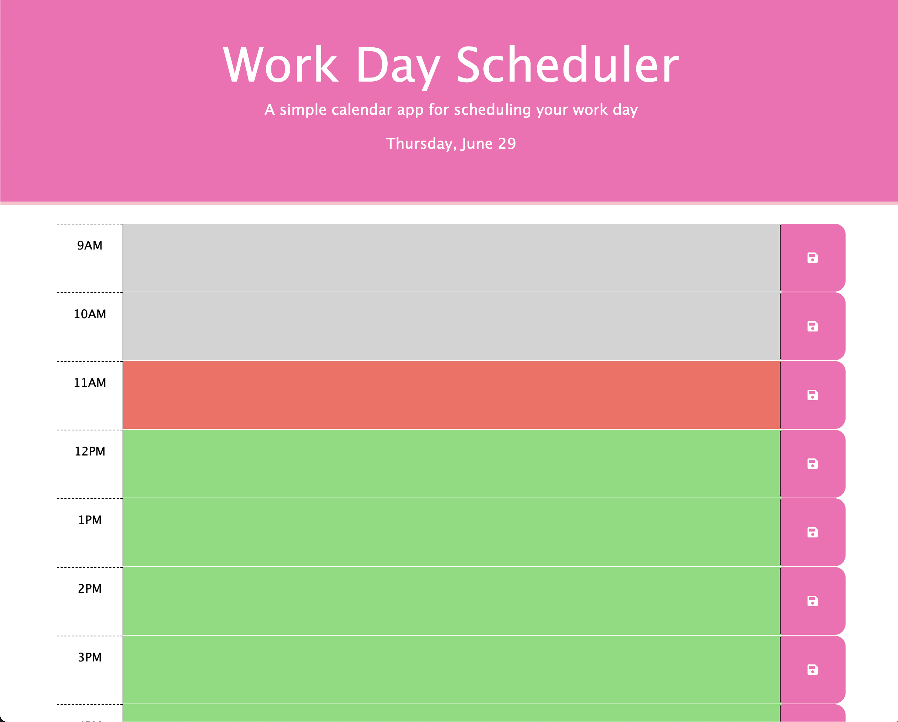

# Work Day Scheduler

## Description

This is a simple calendar app for scheduling your work day. The app displays the current date and hour blocks from 9am-5pm where the user can enter his or her tasks and save them. These tasks will be saved even when you refresh the browser and leave the page if the user clicks the save button to the right of each block. This app uses day.js to display the current date and know the current hour of each day.

## Installation

N/A

## Usage

When the scheduler is open, the user will see the current date at the top of the page and 8 hour blocks from 9am-5pm. Each block will have a corresponding color that shows whether each time is in the past, present, or future.

Past: Gray
Present: Red
Future: Green

The user can click into each time block and enter his or her tasks for that hour. The user can then save that task by clicking the save button beside the hour block.

When the page is refreshed, the input will still appear.

View screenshot of webpage below:

Link to webpage: https://nstark12.github.io/work-day-schedule/

## Credits

N/A

## License

Please refer to the LICENSE in the repo.